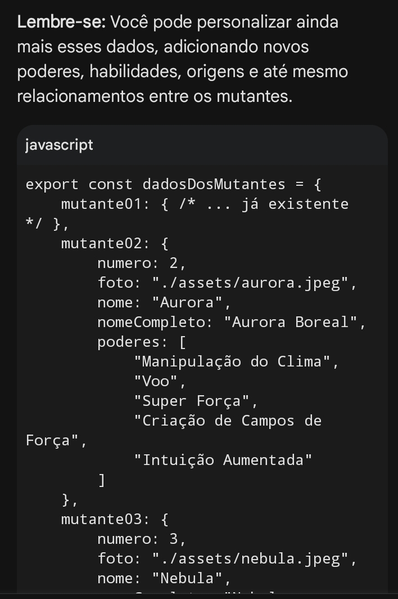
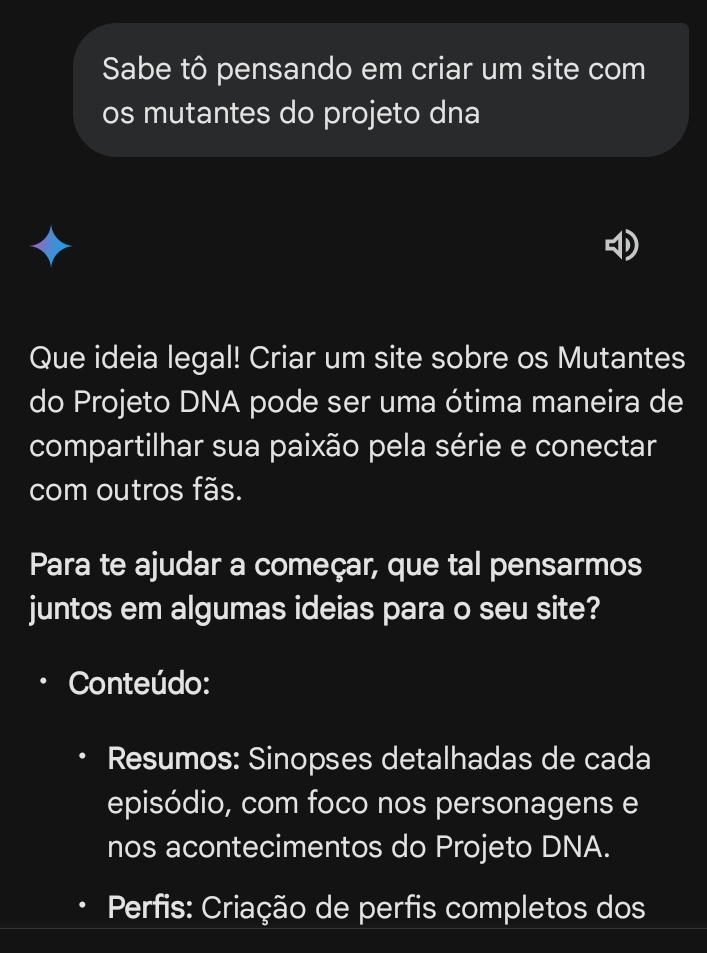
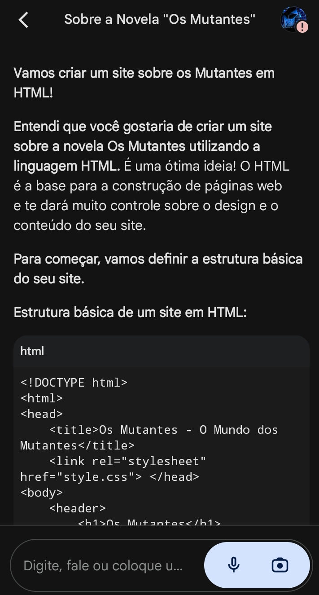
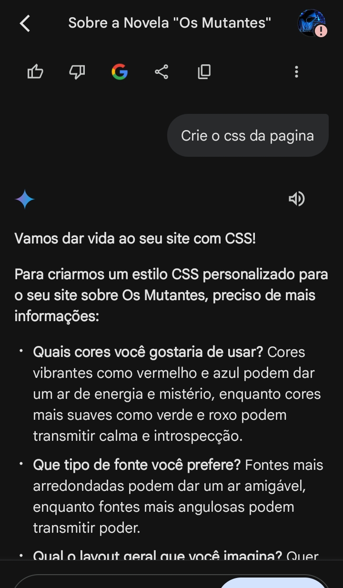
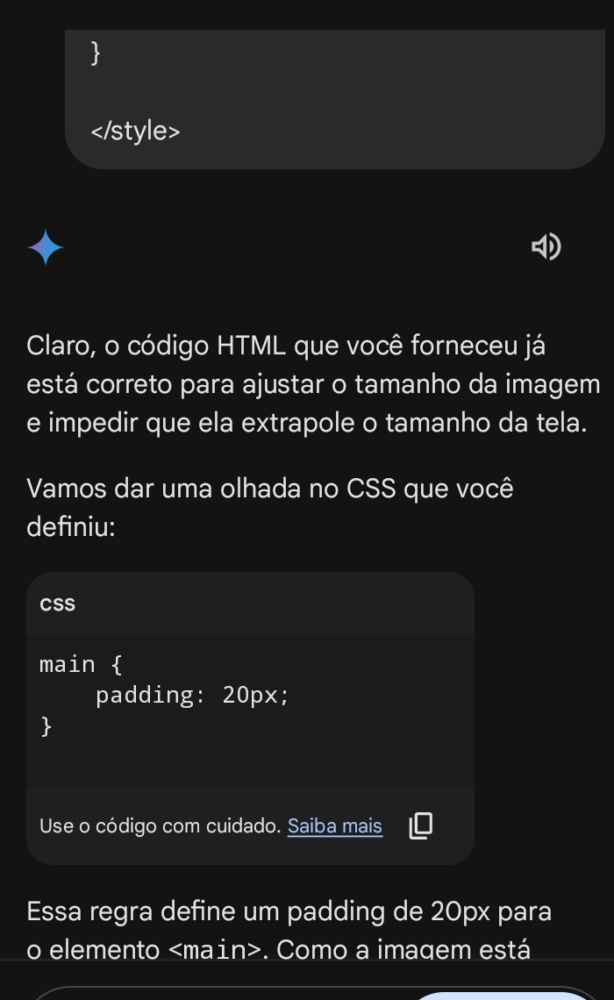
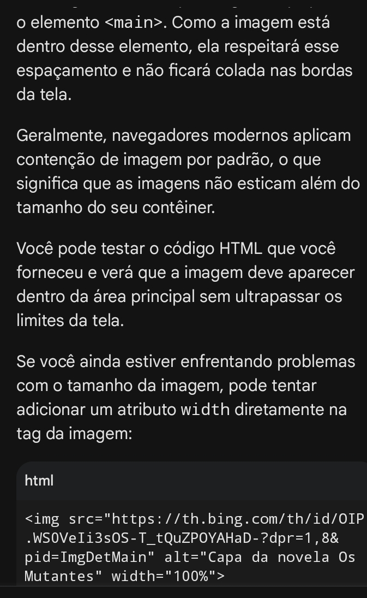

# Lista de Mutantes

Este site é uma lista onde você pode encontrar alguns dos mutantes mais poderosos da novela.

**Como usar:**

1. **Explore os mutantes:** Clique nos botões para ver todos os mutantes ou buscar por um específico.
2. **Descubra seus poderes:** Leia tudo sobre os poderes de cada mutante e veja como eles são incríveis.
3. **Divirta-se!**

**Como acessar:**

Você pode acessar o site dos Mutantes através do seguinte link: [Mutantes](https://exemplo.com).

**Tecnologias usadas:**

* Google Gemini
* Criado durante a Imersão Dev da Alura

**Páginas concluídas:**

Até o momento, duas páginas foram concluídas:

1. **Home:** Página inicial com uma apresentação sobre a novela.
2. **Projeto DNA:** Página onde você pode começar a explorar os mutantes.

**Processo de criação com o Google Gemini:**

Quando comecei a conversar com o Gemini, falei que queria fazer um site com alguns dos mutantes da novela *Os Mutantes*. Pedi para ele criar um design, mas ele explicou que não podia gerar imagens. Então, especifiquei que queria que ele descrevesse uma ideia de como seria esse site.

Depois, pedi para ele criar um card para cada um dos mutantes, contendo o **nome**, **número**, **nome completo**, **imagem** e **poderes**.

Posteriormente, pedi para ele criar uma caixa de texto para **pesquisar** os mutantes salvos no arquivo `dados.js`, que é um arquivo com todos os dados dos mutantes, como foi mostrado nas aulas da Imersão Dev com Gemini.

Ele criou, mas eu queria um sistema de pesquisa mais avançado. Então, sugeri que ele adicionasse uma forma de pesquisar não apenas pelo número, mas também pelo nome e pelos poderes.

Por fim, pedi para ele criar este README, que você está lendo agora.

**Imagens do projeto:**

Aqui você pode adicionar imagens do projeto, como screenshots das páginas, exemplos de uso, entre outros.

**Imagens e Prompts do Gemini:**

1. 
2. 
3. 
4. 
5. 
6. 

**Autor:**

* Luciano Quintela
